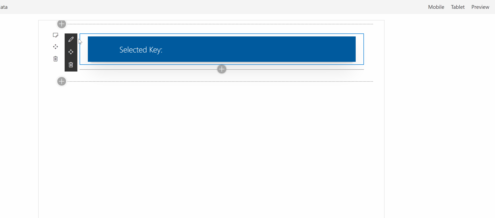

## spfx-async-dropdown


[](https://www.npmjs.com/package/spfx-async-dropdown)

Asynchronous dropdown component for the SPFx property pane



## Installation

```bash
npm install spfx-async-dropdown
```

```bash
import { PropertyPaneAsyncDropdown } from "spfx-async-dropdown"
```

## Examples

#### Get lists that are in the root web using [pnpjs](https://pnp.github.io/pnpjs/)

```bash
new PropertyPaneAsyncDropdown("list", {
    label: "List",
    onLoad: async () => {
        const lists = await sp.site.rootWeb.lists.select("Id", "Title").get();
        return lists.map(list => {
            return {
                key: list.Id,
                text: list.Title
            }
        })
    },
    onPropertyChange: (property: string, newValue: any) => {
        const oldValue = get(this.properties, property);
        update(this.properties, property, () => newValue);
        this.onPropertyPaneFieldChanged(property, oldValue, newValue);
        this.render();
    },
    selectedKey: this.properties.list,
    required: true,
    tooltip: {
        content: "Testing Tooltip",
        iconName: "List"
    },
    placeholder: "Select an item...",
    description: "Lorem ipsum dolor sit amet, consetetur sadipscing elitr, sed diam nonumy eirmod tempor invidunt ut labore et dolore magna aliquyam erat, sed diam voluptua"
})
```

## Props

| Prop                              |                                                                     Type                                                                     |
| :-------------------------------- | :------------------------------------------------------------------------------------------------------------------------------------------: |
| label<br/>_(required)_            |                                                                    string                                                                    |
| onLoad<br/>_(required)_           |                                                       () => Promise<IDropdownOption[]>                                                       |
| onPropertyChange<br/>_(required)_ |                                                  (property: string, newValue: any) => void                                                   |
| selectedKey<br/>_(required)_      |                                                               string or number                                                               |
| disabled                          |                                                                   boolean                                                                    |
| required                          |                                                                   boolean                                                                    |
| tooltip                           | IToolTip ({ content: string, iconName: string}). iconName is a [Fabric icon](https://developer.microsoft.com/en-us/fabric#/styles/web/icons) |
| placeholder                       |                                                                    string                                                                    |
| description                       |                                                                    string                                                                    |
